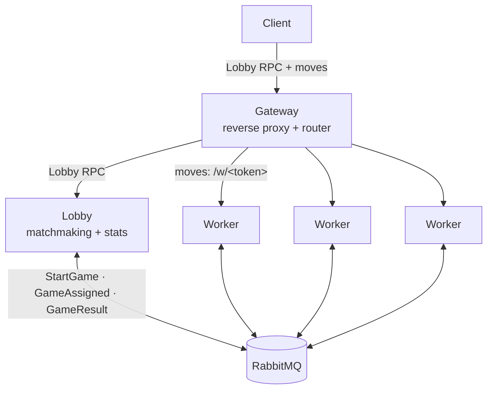

# Tic-Tac-Toe Backend

A two-player, turn-based tic-tac-toe backend in Go. Board size and win length are
configurable **per game**, all state is kept in memory, and the design splits a
**control plane** (matchmaking / assignment / results over a message broker) from a
**data plane** (moves over HTTP) so the authority is never a bottleneck.

> **The full design walkthrough is in the slides** — the two planes, message flow,
> routing/tokens, concurrency, scaling and trade-offs, all with diagrams. Read
> [demo/slides/slides.md](demo/slides/slides.md), or open **http://localhost:8100**
> once the stack is running. The key decisions are recorded as short ADRs in
> [ADR.md](ADR.md).

> **What to review.** The Go service under [`backend/`](backend/) is the case study.
> The browser UI and the slides live under [`demo/`](demo/) and are **not** part of
> the review — you never need to open `demo/` to understand the backend.

## Architecture



- **Gateway** — one edge origin: proxies lobby calls and routes each move to the
  worker that owns the game. Stateless.
- **Lobby** — the single authority: matchmaking and stats. Never on the move path.
- **Workers** — hold live boards in memory; scale horizontally.
- **RabbitMQ** — the control plane. The lobby and workers connect only to the
  broker, never to each other.

*Why a broker, how the signed `/w/<token>` routing works, and how each tier scales
are covered in the slides.*

## Run

Needs Docker + Docker Compose (and Go 1.26+ to build/test locally).

```sh
docker compose up --build
```

| URL                              | Purpose                                   |
|----------------------------------|-------------------------------------------|
| http://localhost:8000            | the game: UI **and** API (single origin)  |
| http://localhost:8100            | architecture slides                       |
| http://localhost:8999            | RabbitMQ dashboard (`admin` / `admin`)    |
| http://localhost:8090/dashboard/ | Traefik dashboard                         |
| localhost:8082                   | lobby, direct gRPC / Connect for tooling  |

To play, open http://localhost:8000 in two browser tabs. Scale the worker pool with
`docker compose up --scale worker=N`.

The API is ConnectRPC, so a browser calls it with a plain JSON `fetch()` and
`grpcurl` works against `:8082`. Create a 4×4, win-4 game:

```sh
curl -X POST http://localhost:8000/tictactoe.v1.Lobby/CreateGame \
  -H 'Content-Type: application/json' \
  -d '{"userId":"alice","boardSize":4,"winLength":4}'
```

## API

The API is defined in [Protocol Buffers](backend/api/proto) and published as
**OpenAPI**, generated from the same protos by `buf generate`. Operation and field
descriptions come from the proto comments and request/response examples from
annotations, so the docs stay in sync with the contract. The spec is served at
**http://localhost:8000/openapi.yaml** and rendered interactively at
**http://localhost:8000/docs.html**.

Every method is a unary `POST` — it's an RPC API (Connect also speaks gRPC and
gRPC-Web, both POST-only), not a REST resource API, so reads and writes alike are
POST. A browser sends JSON; `grpcurl` works against `:8082`.

- **Lobby** (`/tictactoe.v1.Lobby/…`) — `CreateGame`, `JoinGame`, `GetGame`,
  `ListPendingGames`, `ListActiveGames`, `GetStats`, `Leaderboard`.
- **Worker** (`/w/<token>/tictactoe.v1.Worker/…`, the token from `GetGame`) —
  `MakeMove`, `GetBoard`.

Flow: **create** → poll `GetGame` until `ASSIGNED` → play via the returned
`/w/<token>` route. The opponent uses `ListPendingGames` → `JoinGame`.

## Test

```sh
cd backend && buf generate && go test ./...   # buf generate: see Code generation
```

The tests are **acceptance tests that pin the ADRs** in [ADR.md](ADR.md): each
`TestXxx` guards one decision (race-free join, bounded games per worker, …) rather
than covering every function.

## Configuration

Every setting is an environment variable with a default, all declared in one place:
[backend/internal/config/config.go](backend/internal/config/config.go). Compose sets
a dev `ROUTING_SECRET`; override it in production
(`ROUTING_SECRET=$(openssl rand -hex 32) docker compose up`).

## Project layout

One binary, three roles — mostly one file per package, so each concern reads in one
place:

```
backend/           the case study (Go module — this is what to review)
  main.go          one binary, dispatches to lobby | worker | gateway
  api/proto/       Protocol Buffer contracts   api/gen/ buf output (git-ignored)
  internal/
    game/          the whole domain (board, rules, state machine)
    lobby/         Lobby service + Run;  matchmaker.go — join CAS + reaper
    worker/        Worker service + per-game concurrency + Run
    gateway/       the edge proxy + token routing + Run
    rabbitmq/      RabbitMQ client + the three messages
    store/         generic Map + per-user stats
    config/        all env settings (struct tags) + game rules
    routing/       signed JWT worker-route capability
    httpx/         HTTP/1.1 + h2c server, graceful shutdown
  *_test.go        ADR acceptance tests, next to the package they exercise
demo/              not reviewed — browser UI, Slidev deck, Traefik config
docker-compose.yml the whole stack   ·   ADR.md
```

## Code generation

The Go bindings and the OpenAPI spec are generated from the `.proto` files and are
**not committed** — the protos are the single source of truth. `docker compose up
--build` generates them inside the image, so running the stack needs no extra step.

For local `go build` / `go test`, bootstrap once from `backend/`:

```sh
# 1. install the generators — they land in $(go env GOPATH)/bin, which must be on PATH
go install github.com/bufbuild/buf/cmd/buf@latest
go install google.golang.org/protobuf/cmd/protoc-gen-go@latest
go install connectrpc.com/connect/cmd/protoc-gen-connect-go@latest
go install github.com/sudorandom/protoc-gen-connect-openapi@latest

# 2. generate the code: api/gen/tictactoev1/ (Go) + api/gen/openapi/openapi.yaml
buf generate

# 3. fetch the module deps and confirm everything compiles
go build ./...
```

Rerun `buf generate` after any change to the `.proto` files. In an editor, the
generated packages don't exist until step 2, so **restart the language server**
after the first generation (VS Code: “Go: Restart Language Server”) — otherwise
gopls keeps showing the imports red until it re-scans.
