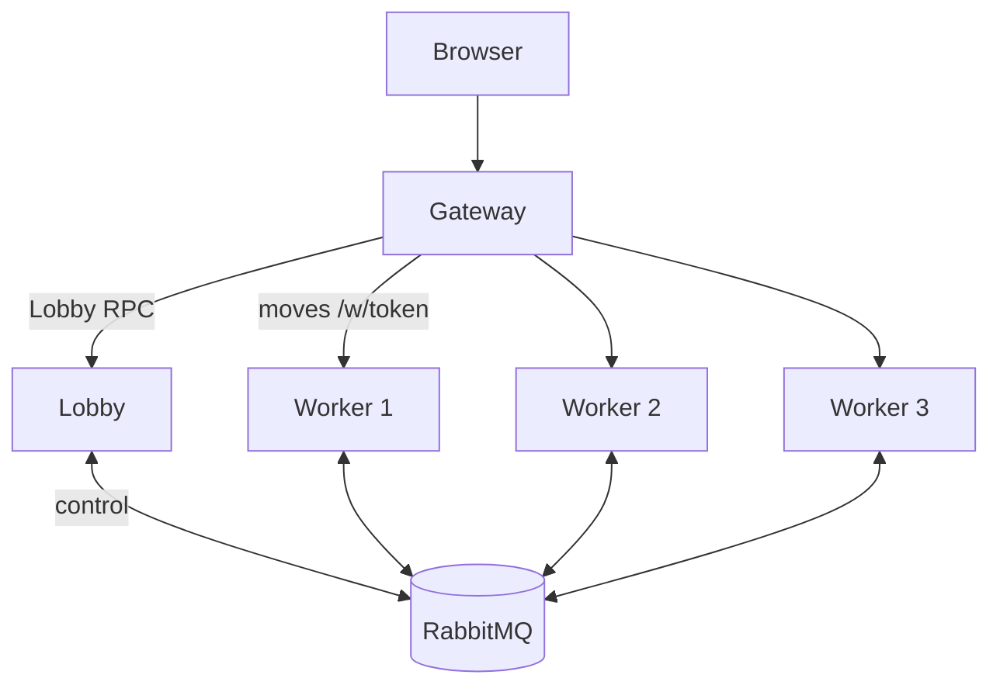
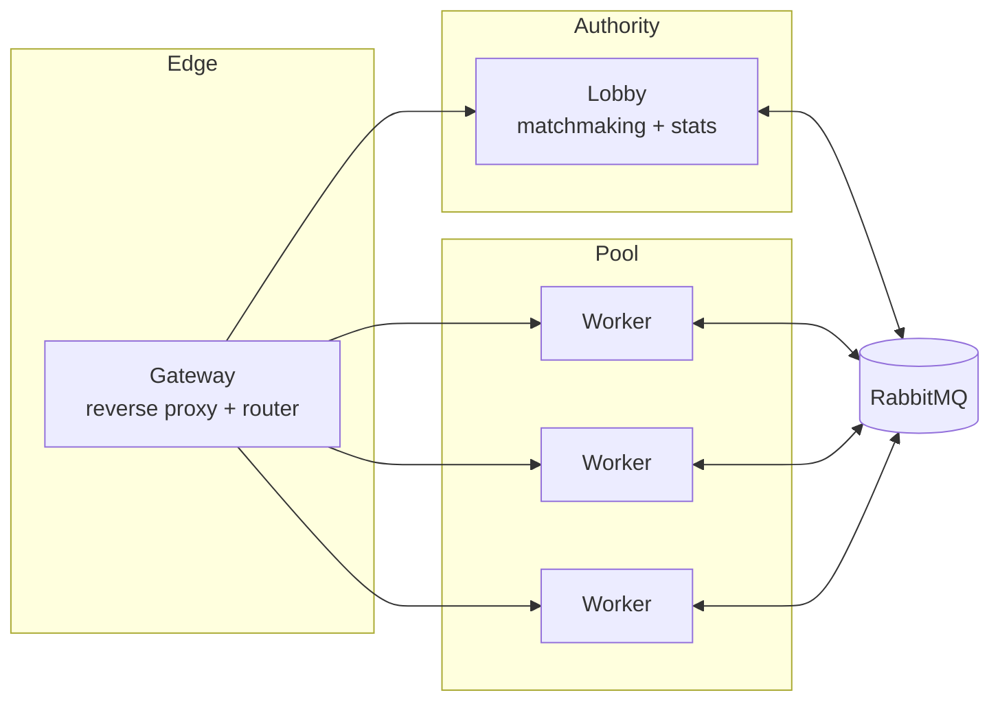
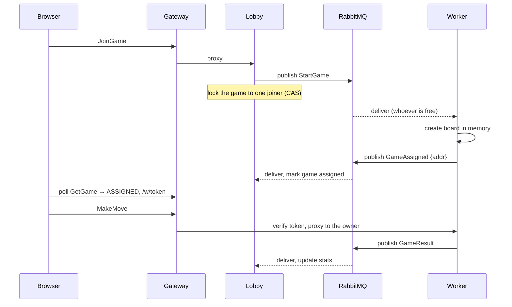

# Tic-Tac-Toe Backend

A scalable, message-driven game backend in **Go**

<div class="pt-4 opacity-70">ConnectRPC · RabbitMQ · Docker Compose</div>

<div class="abs-br m-6 opacity-50 text-sm">press → to move through the slides</div>

---

# The brief

Build the backend for a two-player, turn-based tic-tac-toe game.

- Create a game and wait, list open games, join, make moves
- Win, lose or draw, and read each player's win/loss/draw stats
- Board size *N* and win length *K* are set **per game**
- Keep state **in memory** — no database
- Build it to **scale** to a lot of players

<div class="mt-8 opacity-70">Also aimed for: clean code, no single point of failure, one-command Docker run, playable in a browser.</div>

---
layout: two-cols
---

# Two planes

One idea shapes the whole design: split the **control plane** from the
**data plane**.

- **Control plane** — matchmaking, assignment, results.
  A few events per game. Carried over a **message broker**.

- **Data plane** — moves. Frequent and latency-sensitive.
  Plain **HTTP**, straight to the worker, never through the authority.

::right::



---

# Components



- **Gateway** — the single entry point. Proxies lobby calls and sends each move
  to the worker that owns the game. Holds no state.
- **Lobby** — the one authority. Matchmaking and stats. Never handles moves.
- **Workers** — keep live boards in memory. Add more to scale.

---

# Why a message broker

The lobby and workers never call each other directly. Each one talks only to the
broker.

- One well-known endpoint to reach, instead of every service tracking every other.
- **Competing consumers** on the work queue *are* the load balancer — no service
  registry and no health checks to build.
- If no worker is free, `StartGame` waits in the queue.
- If the lobby restarts for a moment, messages just wait for it.

---

# Message flow



---

# Three messages

The whole control plane is three JSON messages on three durable queues.

```go
type StartGame struct {        // lobby → workers (competing consumers)
    GameID               string
    PlayerX, PlayerO     string
    BoardSize, WinLength int   // chosen per game
}
type GameAssigned struct {     // worker → lobby
    GameID     string
    WorkerAddr string          // DNS name, not a raw IP
}
type GameResult struct {       // worker → lobby
    GameID           string
    PlayerX, PlayerO string
    WinnerID         string
    Draw             bool
}
```

---

# Per-game configuration

Board size and win length are set when a game is **created**, not fixed globally.

```go
func (s *Service) CreateGame(req *CreateGameRequest) (...) {
    // 0 means "use the server default"
    cfg, err := s.gameConfig(req.BoardSize, req.WinLength)
    if err != nil {
        return InvalidArgument(err)          // win length must be ≤ board size
    }
    m := s.matches.Create(req.UserId, newID(), cfg)   // stored on the match
}
```

- The same `config.NewGame` validates the server default and every game — one
  rule, one place.
- The chosen size travels in `StartGame`; the worker builds an *N×N* board with a
  *K-in-a-row* check.

---

# Routing a move to the right worker

The browser reaches a worker *through* the gateway. It must never name the host,
and a worker's address can change.

- **A signed capability, not an address.** On assignment the lobby signs a
  short-lived **JWT** naming the worker and game. The gateway checks it and
  proxies only to that worker — a client can't aim traffic anywhere else.
- **Addressed by DNS name, not IP.** The worker advertises its hostname
  (`os.Hostname()`, or a StatefulSet pod name), resolved at call time.
- **Clean failure.** If the worker is gone, the gateway returns `410 Gone` and the
  client starts a new game — no hang. Its in-memory board is gone anyway.

---

# Design patterns

| Pattern | Where | Why |
|---|---|---|
| **Strategy** | `WinChecker` | configurable *N×K*; scans 4 axes through the last move |
| **State** | `Game` aggregate | `Active → Won/Drawn`; `ApplyMove` enforces the rules |
| **Repository** | `store.Map[V]`, stats | in-memory now, DB-swappable later |
| **Facade** | Connect handlers | thin layer between RPC and the domain |
| **Functional options** | `config.NewGame(...)` | idiomatic Go configuration |

<div class="mt-4 opacity-80">Mostly standard library. External deps: ConnectRPC, protobuf, amqp091, JWT, env.</div>

---

# Concurrency

- **Join race** — when two people join the same open game, the lobby does one
  compare-and-swap. Exactly one wins; the other is told it's taken.

- **Per-game lock** — every live game has its own mutex. Games never block each
  other; only the two players of one game share a lock, and they take turns.

- **Identity is the `user_id`** — checked against the game's players. No session
  state to keep.

---

# Scaling — each tier on its own

| Tier | Scales | How |
|---|---|---|
| **Worker** | horizontal | `--scale worker=N`; the broker spreads the work |
| **Gateway** | horizontal | stateless — N replicas behind Traefik |
| **Traefik** | horizontal | stateless — N behind an L4 load balancer |
| **RabbitMQ** | cluster | quorum queues (already durable) |
| **Lobby** | *not as-is* | shard by game/user, or move state to a store |

<div class="mt-4 opacity-80">

The **lobby** is the one stateful authority (matchmaking + stats, in memory). It's
off the move path — about 3 events per game — so it scales *up* a long way. To
scale *out*, shard it or move state to Redis behind the `Matchmaker` / `StatsStore`
seams.

</div>

---

# Trade-offs

- **In memory, no durability** — a worker crash loses its live games. The
  repository interfaces are where a database would slot in.
- **Gateway on the move path** — the cost of one scalable worker service; the
  authority still never sees a move.
- **Polling, not streaming** — the brief rules out streaming, and turn-based play
  makes polling fine.
- **Best-effort results** — a lost `GameResult` means one missed stat update.

---
layout: center
class: text-center
---

# Play it

Everything (game, API, slides, broker dashboard):

```
docker compose up --build
```

Game: **http://localhost:8000** — open two tabs &nbsp;·&nbsp; Slides: **http://localhost:8100**

<div class="mt-6 opacity-70">
Go · ConnectRPC · RabbitMQ · Docker Compose · vanilla-JS client
</div>
